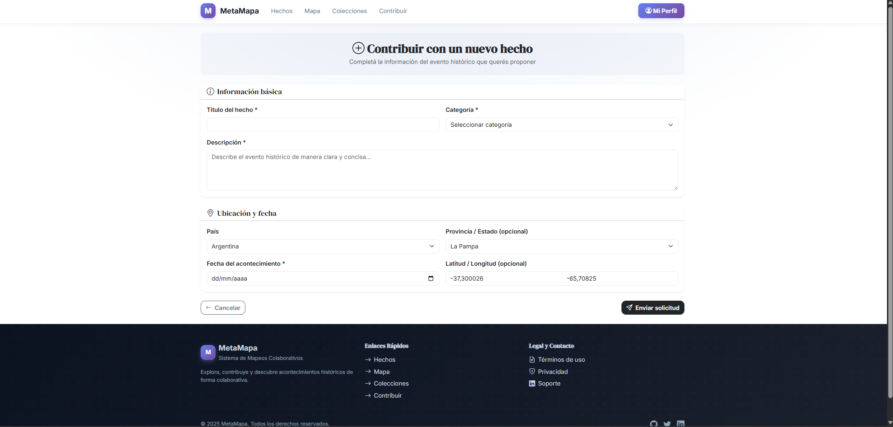
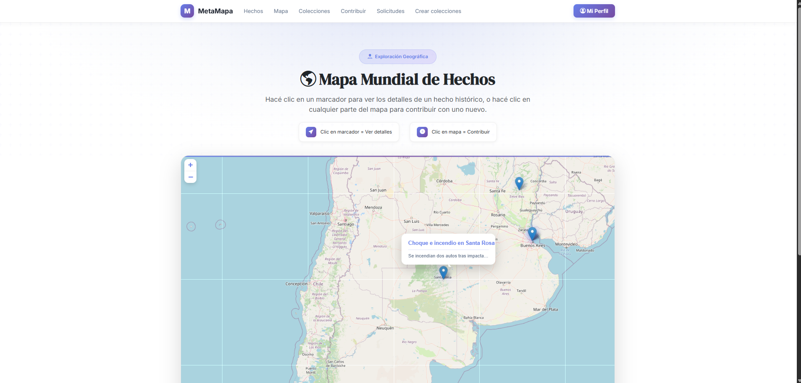
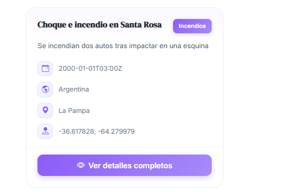
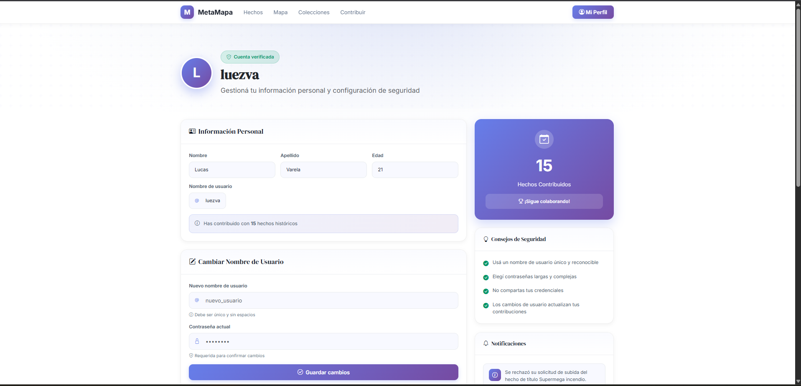

# Trabajo Práctico Anual Diseño de Sistemas de Información 2025: MetaMapa 

## El presente trabajo consiste en una aplicación web en la cual se pueden cargar hechos y visualizarlos en un mapa interactivo.

- Está estructurado en dos proyectos Maven que se comunican entre sí mediante API Rest. 
  - Server Backend: Encargado de la lógica de negocio.
    - Tecnologías: Java Spring Boot, MySQL, Hibernate/JPA
  - Server Frontend: Encargado del renderizado de las vistas, de forma tal que el proyecto resulta ser de cliente liviano desacoplado.
    - Tecnologías: HTML, CSS, Javascript, Thymeleaf, Bootstrap
  

---

## Algunos ejemplos de uso

  

---

  

---

  

---

  

